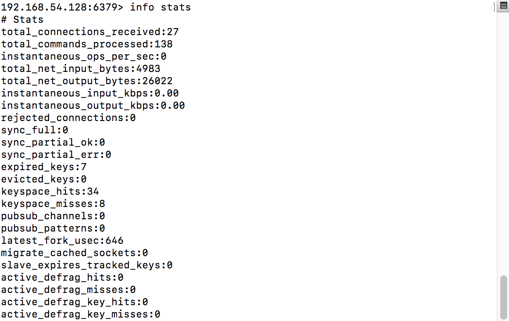

## redis查看状态信息
* info   all|default
* Info 指定项

## server服务器信息
* redis_version : Redis 服务器版本
* redis_git_sha1 : Git SHA1
* redis_git_dirty : Git dirty flag
* os : Redis 服务器的宿主操作系统
* arch_bits : 架构（32 或 64 位）
* multiplexing_api : Redis 所使用的事件处理机制
* gcc_version : 编译 Redis 时所使用的 GCC 版本
* process_id : 服务器进程的 PID
* run_id : Redis 服务器的随机标识符（用于 Sentinel 和集群）
* tcp_port : TCP/IP 监听端口
* uptime_in_seconds : 自 Redis 服务器启动以来，经过的秒数
* uptime_in_days : 自 Redis 服务器启动以来，经过的天数
* lru_clock : 以分钟为单位进行自增的时钟，用于 LRU 管理

	
## clients已连接客户端信息
* connected_clients : 已连接客户端的数量（不包括通过从属服务器连接的客户端）
* client_longest_output_list : 当前连接的客户端当中，最长的输出列表
* client_longest_input_buf : 当前连接的客户端当中，最大输入缓存
* blocked_clients : 正在等待阻塞命令（BLPOP、BRPOP、BRPOPLPUSH）的客户端的数量

## memory内存信息
* used_memory : 由 Redis 分配器分配的内存总量，以字节（byte）为单位
* used_memory_human : 以人类可读的格式返回 Redis 分配的内存总量
* used_memory_rss : 从操作系统的角度，返回 Redis 已分配的内存总量（俗称常驻集大小）。这个值和top 、 ps 等命令的输出一致。
* used_memory_peak : Redis 的内存消耗峰值（以字节为单位）
* used_memory_peak_human : 以人类可读的格式返回 Redis 的内存消耗峰值
* used_memory_lua : Lua 引擎所使用的内存大小（以字节为单位）
* mem_fragmentation_ratio :used_memory_rss 和 used_memory 之间的比率
* mem_allocator : 在编译时指定的， Redis 所使用的内存分配器。可以是 libc 、 jemalloc 或者 tcmalloc 。
* 在理想情况下， used_memory_rss 的值应该只比used_memory 稍微高一点儿。
* 当 rss > used ，且两者的值相差较大时，表示存在（内部或外部的）内存碎片。
* 内存碎片的比率可以通过 mem_fragmentation_ratio 的值看出。
* 当 used > rss 时，表示 Redis 的部分内存被操作系统换出到交换空间了，在这种情况下，操作可能会产生明显的延迟。
* Because Redis does not have control over how its allocations are mapped to memory pages, highused_memory_rss is often the result of a spike in memory usage.
* 当 Redis 释放内存时，分配器可能会，也可能不会，将内存返还给操作系统。
* 如果 Redis 释放了内存，却没有将内存返还给操作系统，那么 used_memory 的值可能和操作系统显示的 Redis 内存占用并不一致。
* 查看 used_memory_peak 的值可以验证这种情况是否发生。

## 4､persistence:RDB和AOF相关持久化信息
* loading:0    一个标志值，记录了服务器是否正在载入持久化文件
* rdb_changes_since_last_save:0    距离最后一次成功创建持久化文件之后，改变了多少个键值
* rdb_bgsave_in_progress:0    一个标志值，记录服务器是否正在创建RDB文件
* rdb_last_save_time:1338011402    最近一次成功创建RDB文件的UNIX时间
* rdb_last_bgsave_status:ok    一个标志值，记录了最后一次创建RDB文件的结果是成功还是失败
* rdb_last_bgsave_time_sec:-1    记录最后一次创建RDB文件耗费的秒数
* rdb_current_bgsave_time_sec:-1    如果服务器正在创建RDB文件，那么这个值记录的就是当前的创建RDB操作已经耗费了多长时间（单位为秒）
* aof_enabled:0    一个标志值，记录了AOF是否处于打开状态
* aof_rewrite_in_progress:0    一个标志值，记录了服务器是否正在创建AOF文件    
* aof_rewrite_scheduled:0    一个标志值，记录了RDB文件创建完之后，是否需要执行预约的AOF重写操作
* aof_last_rewrite_time_sec:-1    记录了最后一次AOF重写操作的耗时
* aof_current_rewrite_time_sec:-1    如果服务器正在进行AOF重写操作，那么这个值记录的就是当前重写操作已经耗费的时间（单位是秒）
* aof_last_bgrewrite_status:ok    一个标志值，记录了最后一次重写AOF文件的结果是成功还是失败

## 5､stats:一般统计信息
* total_connections_received:1    服务器已经接受的连接请求数量
* total_commands_processed:0    服务器已经执行的命令数量
* instantaneous_ops_per_sec:0    服务器每秒中执行的命令数量
* rejected_connections:0    因为最大客户端数量限制而被拒绝的连接请求数量
* expired_keys:0    因为过期而被自动删除的数据库键数量
* evicted_keys:0    因为最大内存容量限制而被驱逐（evict）的键数量
* keyspace_hits:0    查找数据库键成功的次数
* keyspace_misses:0    查找数据库键失败的次数
* pubsub_channels:0    目前被订阅的频道数量
* pubsub_patterns:0    目前被订阅的模式数量
* latest_fork_usec:0    最近一次fork()操作耗费的时间(毫秒)

## 6､replication:主从复制信息,master上显示的信息
* role:master                               #实例的角色，是master or slave
* connected_slaves:1              #连接的slave实例个数
* slave0:ip=192.168.64.104,port=9021,state=online,offset=6713173004,lag=0 #lag从库多少秒未向主库发送REPLCONF命令
* master_repl_offset:6713173145  #主从同步偏移量,此值如果和上面的offset相同说明主从一致没延迟
* repl_backlog_active:1                   #复制积压缓冲区是否开启
* repl_backlog_size:134217728    #复制积压缓冲大小
* repl_backlog_first_byte_offset:6578955418  #复制缓冲区里偏移量的大小
* repl_backlog_histlen:134217728   #此值等于 master_repl_offset - repl_backlog_first_byte_offset,该值不会超过repl_backlog_size的大小

## 6､replication:主从复制信息,slave上显示的信息
* role:slave                                        #实例的角色，是master or slave
* master_host:192.168.64.102       #此节点对应的master的ip
* master_port:9021                          #此节点对应的master的port
* master_link_status:up                   #slave端可查看它与master之间同步状态,当复制断开后表示down
* master_last_io_seconds_ago:0  #主库多少秒未发送数据到从库?
* master_sync_in_progress:0        #从服务器是否在与主服务器进行同步
* slave_repl_offset:6713173818   #slave复制偏移量
* slave_priority:100                          #slave优先级
* slave_read_only:1                         #从库是否设置只读
* connected_slaves:0                      #连接的slave实例个数
* master_repl_offset:0         
* repl_backlog_active:0                  #复制积压缓冲区是否开启
* repl_backlog_size:134217728   #复制积压缓冲大小
* repl_backlog_first_byte_offset:0 #复制缓冲区里偏移量的大小
* repl_backlog_histlen:0           #此值等于 master_repl_offset - repl_backlog_first_byte_offset,该值不会超过repl_backlog_size的大小

## 7､cpu:cpu计算量统计信息
* used_cpu_sys:0.03    Redis服务器耗费的系统CPU
* used_cpu_user:0.01    Redis服务器耗费的用户CPU
* used_cpu_sys_children:0.00    Redis后台进程耗费的系统CPU
* used_cpu_user_children:0.00    Redis后台进程耗费的用户CPU

## 8､commandstats:redis命令统计信息
* cmdstat_get:calls=1664657469,usec=8266063320,usec_per_call=4.97 #call每个命令执行次数,usec总共消耗的CPU时长(单位微秒),平均每次消耗的CPU时长(单位微秒)

## 9､cluster:redis集群信息
* cluster_enabled:1   #实例是否启用集群模式

## 10､keyspace:数据库相关的统计信息
* db0:keys=2,expires=0,avg_ttl=0    0号数据库有2个键、已经被删除的过期键数量为0、以及带有生存期的key的数量

## redis性能查看与监控常用工具
1.redis-benchmark
> redis基准信息，redis服务器性能检测  
> redis-benchmark -h localhost -p 6379 -c 100 -n 100000  
> 100个并发连接，100000个请求，检测host为localhost 端口为6379的redis服务器性能  