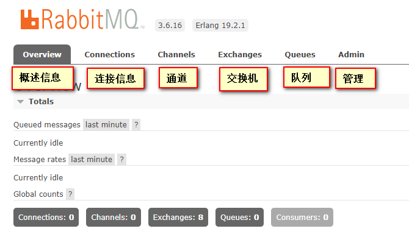

### 安装erlang环境
http://erlang.org/download/otp_src_19.2.tar.gz


```
    [root@localhost src]# tar -xvf otp_src_19.2.tar.gz 
    [root@localhost src]# cd otp_src_19.2
    [root@localhost src]# ./configure --prefix=/usr/local/erlang --enable-smp-support --enable-threads --enable-sctp --enable-kernel-poll --enable-hipe --with-ssl --without-javac
    [root@localhost src]# make && make install
    #配置环境变理
    [root@localhost src]# vim /etc/profile
        PATH=$PATH:/usr/local/erlang/bin
    [root@localhost src]# source /etc/profile
    #验证是否安装成功
    [root@localhost src]#  erl
        Erlang/OTP 19 [erts-8.2] [source] [64-bit] [async-threads:10] [hipe] [kernel-poll:false]

        Eshell V8.2  (abort with ^G)
        1> 
        BREAK: (a)bort (c)ontinue (p)roc info (i)nfo (l)oaded
            (v)ersion (k)ill (D)b-tables (d)istribution
```

erlang语言编译配置选项：    
* prefix 指定安装目录 
* enable-smp-support启用对称多处理支持（Symmetric Multi-Processing对称多处理结构的简称）
* enable-threads启用异步线程支持
* enable-sctp启用流控制协议支持（Stream Control Transmission Protocol，流控制传输协议）
* enable-kernel-poll启用Linux内核poll
* enable-hipe启用高性能Erlang –with-ssl 启用ssl包 
* without-javac 不用java编译

### 安装rabbit
http://www.rabbitmq.com/releases/rabbitmq-server/v3.6.1/rabbitmq-server-generic-unix-3.6.1.tar.xz

```
    [root@localhost src]# tar -xvf rabbitmq-server-generic-unix-3.6.1.tar.xz
    [root@localhost src]# mv rabbitmq_server-3.6.1/ rabbitmq
    [root@localhost src]# mv rabbitmq /usr/local/
    #配置rabbitmq环境变量
    [root@localhost src]# vim /etc/profile
        PATH=$PATH:/usr/local/rabbitmq/sbin
    [root@localhost src]# source /etc/profile
    #启动服务 -detached代表后台守护进程方式启动。
    [root@localhost src]# rabbitmq-server -detached
    #查看状态
    [root@localhost src]# rabbitmqctl status

```
相关命令：
* rabbitmq-server -detached：启动服务
* rabbitmqctl status：查看状态
* rabbitmqctl stop：关闭服务
* rabbitmqctl list_users：列出角色

### 配置网页插件

```
    [root@localhost src]# mkdir /etc/rabbitmq
    [root@localhost src]# rabbitmq-plugins enable rabbitmq_management
    #默认网页是不允许访问的，需要增加一个用户修改一下权限
    #添加用户
    [root@localhost src]# rabbitmqctl add_user admin 123456
    #添加权限
    [root@localhost src]# rabbitmqctl set_permissions -p / admin ".*" ".*" ".*"
    #修改用户角色
    [root@localhost src]# rabbitmqctl set_user_tags admin administrator
    
```
默认的guest/guest用户只能从localhost地址登录
登录：http://l27.0.0.1:15672    

关闭防火墙
```
    #查看防火墙状态
    [root@localhost src]# firewall-cmd --state
    #关闭防火墙
    [root@localhost src]# systemctl stop firewalld.service
    #禁止开机启动
    [root@localhost src]# systemctl disable firewalld.service 
```




### Manage面板
* Overview：概述信息
* Connetions：连接信息
* Channels：通道
* Exchanges：交换机
* Queue：队列
* Admin：管理

### 配置
* LOG_BASE	RabbitMQ日志的存储目录, 默认为"RabbitMQ安装目录/var/log/rabbitmq/".
* NODENAME	当前节点名称, 这在集群中很有用. 默认为"rabbit@主机名", 其中主机名默认是"hostname -s"命令的结果.
* RabbitMQ集群各节点间是通过主机名相互交流的, 因此该节点如果要和其他节点一起构成集群, 请务必确保主机名是域名(不能localhost)或IP, 即确保主机名可被同个子网中其他计算机ping通, 否则该节点将无法加入集群.
* USE_LONGNAME	节点名是否使用长名称, 默认为"false". 短节点名样式为"rabbit@xx", 长节点名样式为"rabbit@xx.yy.zz". 如果该节点会加入集群, 我建议将该值置为"true".
* NODE_IP_ADDRESS	默认会绑定到所有IP, 通过此配置可绑定到特定IP.
* NODE_PORT	端口, 默认是5672.
* CONFIG_FILE	获取普通配置文件(rabbitmq.conf)的路径.
* ADVANCED_CONFIG_FILE	获取高级配置文件(advanced.config)的路径.
* CONF_ENV_FILE	获取环境变量配置文件(rabbitmq-env.conf)路径.


### error
    ```
    configure: error: No curses library functions found
    configure: error: /bin/sh '/usr/local/src/rabbitmq/otp_src_19.2/erts/configure' failed for erts
    yum -y install ncurses-devel
    yum install ncurses-devel


    Error: dependent plugins [crypto,ssl] not found; used by [mochiweb,cowlib, cowboy].

    Error: dependent plugins [crypto,ssl] not found; 

    ```